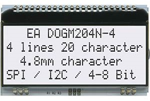

# Pantalla LCD EA-DOGM204N-A con I2C

Se implementa un nuevo componente IDF para manejar la pantalla EA-DOGM204N-A con el protocolo I2C.

La librería contiene funciones que permiten enviar comandos y texto, además de cambiar el set de caracteres imprimibles o configurar el contraste mediante software.